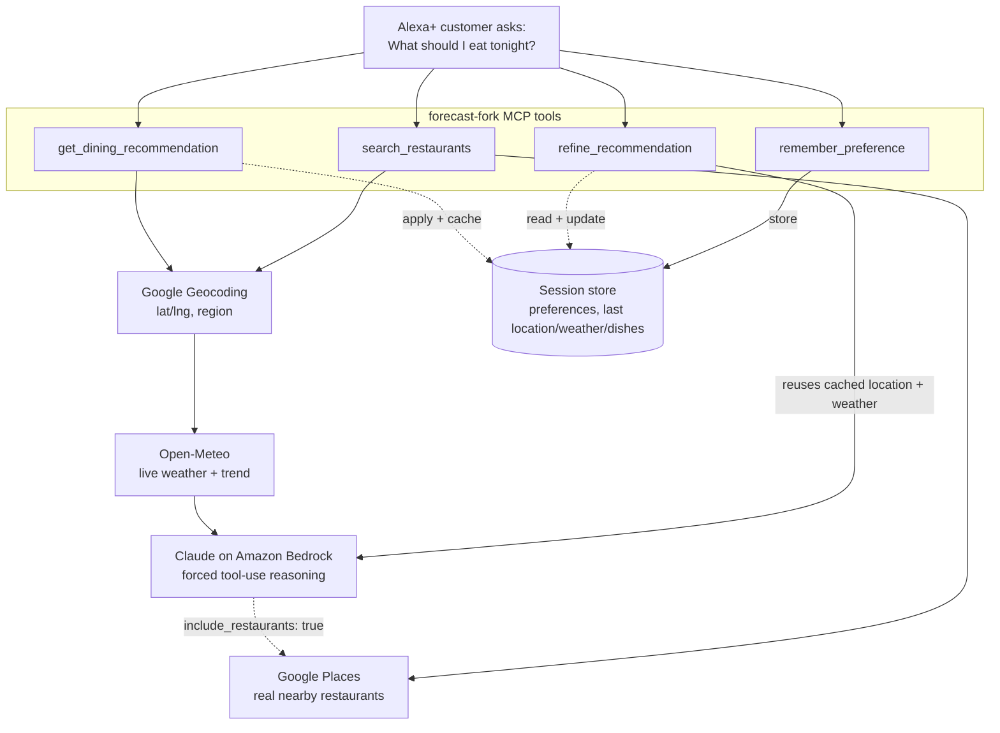

# forecast-fork

An MCP server that recommends what to eat right now, based on live location + weather,
reasoned over with an LLM's cultural/culinary knowledge — not a cuisine keyword filter.

Built for the **Alexa+ track**: Alexa+ acts as the MCP client, discovers `get_dining_recommendation`,
`refine_recommendation`, `remember_preference`, and `search_restaurants`, and calls them as a
customer asks "what should I eat tonight?", reacts to the suggestion ("something cheaper"), or
states a standing preference ("I'm vegetarian") — an agentic workflow that keeps context across
turns, not a single-shot Q&A.

Inspired by an arxiv paper on agentic dining recommendation (location tool + weather tool + LLM
reasoning) and extends [this blog post's](https://kadhar.dev/blog/agentic-restaurant-discovery)
location + restaurant-search pipeline with the piece the paper actually contributes: **weather as
a first-class input to the reasoning step**, prompting the model to reason about what's culturally
comforting given the weather — not just filter by cuisine, price, or hours.

## Demo

https://youtu.be/iFRsbkJIBl8


## Architecture



`get_dining_recommendation` auto-chains into restaurant search when `include_restaurants: true` —
one customer question triggers geocode → weather → LLM reasoning → restaurant search as a single
orchestrated call, using Bedrock's forced tool-use to get the dish name back as structured data
(not parsed from prose) so it can feed directly into the Places query. `search_restaurants` also
stays exposed standalone, so Alexa+ can call it independently too.

**Session memory** (`src/lib/session.ts`) is what turns this from a single-turn Q&A bot into a
multi-turn agentic workflow: pass any stable `session_id` (a per-conversation or per-customer id
that Alexa+ would supply) to `get_dining_recommendation`, and it's kept alive for `remember_preference`
and `refine_recommendation` to build on — standing dietary preferences persist across turns without
being restated, and "not that, something cheaper" reuses the cached location/weather instead of
re-geocoding, while avoiding previously-rejected dishes. It's an in-memory, per-process `Map` —
deliberately simple for a hackathon build; a real deployment would back it with a shared store
(Redis/DynamoDB) so it survives restarts and works across multiple server instances.

**Weather-aware vs. weather-blind comparison** (`npm run demo:weather-impact`) — runs the same
location through the reasoning step with and without weather context, to make visible what the
weather input actually changes about the recommendation (this is the paper's core contribution,
not something a cuisine-filter recommender can replicate).

## Setup

```bash
npm install
cp .env.example .env   # fill in Google Maps key + AWS credentials/Bedrock API key
npm run dev             # stdio MCP server — for Claude Desktop, MCP Inspector
```

Your `GOOGLE_MAPS_API_KEY` needs both **Geocoding API** and **Places API** enabled in
[Google Cloud Console](https://console.cloud.google.com/) → APIs & Services → Library.

For Bedrock, either set `AWS_BEARER_TOKEN_BEDROCK` (a Bedrock API key from the Bedrock console →
API keys — simplest) or a full IAM access key pair. Either way, confirm your `BEDROCK_MODEL_ID`
shows **Access granted** under Bedrock → Model access, and if it's a newer model that requires an
inference profile, use the full inference profile ARN (e.g.
`arn:aws:bedrock:us-east-2:<account>:inference-profile/...`) as `BEDROCK_MODEL_ID`, with
`AWS_REGION` matching the region in that ARN.

### CLI smoke tests (no UI, fastest way to check the pipeline works)

```bash
npm run smoke:weather -- "Chennai, India"        # geocode + weather only, no Bedrock needed
npm run smoke:restaurants -- "Chennai, India"    # + Google Places search, no Bedrock needed
npm run smoke -- "Chennai, India"                # full pipeline incl. restaurant chaining, needs Bedrock
npm run demo:weather-impact -- "Chennai, India"  # weather-aware vs. weather-blind side-by-side, needs Bedrock
npm run smoke:session -- "Chennai, India"        # remember_preference → get → refine, needs Bedrock
```

### Real measured performance (`npm run load-test`, real numbers from one run)

30 regions across 5 climate zones, 120 total API calls, 100% success on every stage:

| Stage | Success | Avg latency |
|---|---|---|
| Geocode | 100% | 260ms |
| Weather | 100% | 705ms |
| Restaurant search | 100% | 406ms |
| **Bedrock reasoning** | **100%** | **6.2s** |

Bedrock tokens measured (not estimated): ~1050 input / ~290 output → ~$0.0075/query at
Sonnet-class Bedrock pricing (verify current rates for your model). Re-run `npx tsx
scripts/load-test.ts` any time to regenerate this with your own model/region — it's not
committed as a static result because it changes with model, region, and Bedrock load.

## Three ways to see it working

The hackathon's requirement is that the repo *calls* an MCP config in code — not just describes
one — and that the demo clearly shows it running. We have three demos, each proving a different
layer:

| | Proves | Needs |
|---|---|---|
| **1. MCP Inspector** | The MCP *protocol* itself works — tool discovery, schemas, live calls | Nothing extra |
| **2. Web UI** | The full pipeline, presented as a simulated Alexa+ device experience | Nothing extra |
| **3. alexa-skill-mcp-bridge** | The actual *orchestration* Alexa+ would do — intent → tool discovery → tool call → spoken response | Separate repo clone, AWS IAM credentials, Nova 2 Lite access |

All three point at the same running server — none of them are mocks. Start it once per session:

```bash
npm run http   # Streamable HTTP transport at http://localhost:8787/mcp — leave this running
```

### 1. MCP Inspector — protocol-level proof

```bash
npm run inspect
```

Opens a browser UI at a printed localhost URL. Shows all four tools with their real JSON schemas.
Pick `get_dining_recommendation`, fill in `location` (e.g. `Chennai, India`) and a `session_id`
(any string), click **Run Tool**, then call `refine_recommendation` with the same `session_id`
and some `feedback` — watch the second result reuse the cached location/weather and avoid the
first suggestion. Confirms the actual MCP wire protocol — tool discovery, schema validation,
invocation, response, and cross-call session state — works, independent of any client.

### 2. Web UI — simulated Alexa+ device experience

With `npm run http` running, open **http://localhost:8787/demo/** in a browser (Chrome for mic
input + spoken responses).

A dark, Echo-style interface: a glowing orb that shifts through idle → listening → thinking →
speaking states, a text input (or literally speak into the mic, if your browser supports
`SpeechRecognition`), example question chips, and a chat transcript. Responses are spoken aloud
via the browser's `SpeechSynthesis` API when available. A `session_id` is generated once per page
load; a "remember a preference" field feeds `remember_preference`, and every recommendation card
carries quick-feedback chips ("Something cheaper", "Not that — try again") plus a free-text field
that call `refine_recommendation` — the multi-turn, context-carrying flow, live in the browser.

This calls `POST /api/recommend`, `/api/refine`, and `/api/remember` (see `src/http.ts`), which
invoke the exact same `getDiningRecommendation()` / `refineRecommendation()` / `rememberPreference()`
functions the MCP tools call — real geocoding, real weather, real Bedrock reasoning, real Places
search. It's not going through the MCP JSON-RPC envelope itself
(that's what Inspector and the bridge prove) — this layer exists purely to make the demo visually
read as an assistant experience rather than a dev tool or terminal.

### 3. alexa-skill-mcp-bridge — real orchestrator, real voice-assistant conversation

[alexa-skill-mcp-bridge](https://github.com/KayLerch/alexa-skill-mcp-bridge) emulates what Alexa+
itself does: an agent (Strands framework, running on Amazon Bedrock AgentCore with Amazon Nova 2
Lite) listens to a request, decides which of our MCP tools to call, calls it over the real MCP
protocol, and turns the result into natural spoken-style language. This is the closest thing to
"see it working like in Alexa" without needing Alexa+'s own Private Preview access (which, per
Amazon's developer site, is currently invite-only for select partners — no public
waitlist/approval queue exists, so this is the realistic path for a hackathon deadline).

**One-time setup** (separate clone, not part of this repo):

```bash
cd ~/Projects   # or wherever
git clone https://github.com/KayLerch/alexa-skill-mcp-bridge.git
cd alexa-skill-mcp-bridge
npm install
git config core.hooksPath .githooks
cp .env.example .env
echo "BRIDGE_MCP_URL=http://localhost:8787/mcp" >> .env
```

**AWS credentials** — the bridge's `doctor` check calls AWS STS directly, so it needs a real IAM
access key/secret pair (our own project's `AWS_BEARER_TOKEN_BEDROCK` Bedrock API key won't satisfy
this — it's Bedrock-only, STS doesn't understand it):

1. AWS Console → IAM → Users → Create user → programmatic access only.
2. Attach an inline policy: `{"Effect":"Allow","Action":["bedrock:InvokeModel","bedrock:InvokeModelWithResponseStream"],"Resource":"*"}`
3. Create an access key (CLI use case) → copy both values.
4. Locally: `aws configure` (region `us-east-1`, since only that region is verified for the
   bridge) then confirm with `aws sts get-caller-identity`.
5. Confirm **Amazon Nova 2 Lite** shows Access granted under Bedrock → Model access in `us-east-1`
   — this is the bridge's own orchestrator model, separate from our project's Claude model.

No Docker, Finch, or CDK bootstrap needed for the **local** track — those are only required for
the cloud/skill tracks (public URL, real device/Alexa simulator).

**Run it** — two terminals:

```bash
# Terminal 1, in this repo
npm run http

# Terminal 2, in the bridge repo
npm run doctor          # verifies Node, config, our MCP server, AWS credentials, model access
npm run chat -- --debug # interactive REPL; --debug prints tool calls as they happen
```

At the `you>` prompt, type something like `what should I eat right now in Chennai, India?` and
watch it print `[info] tool call (get_dining_recommendation)` before answering in natural
language — genuine tool discovery and invocation, not a script.

One real, worth-keeping finding from this: the bridge simulates Alexa's response deadline
(~6.5s). Our Bedrock reasoning step alone averages ~6.2s (see measured table above), so it's
common to see the natural "I'm still working on that, ask me again in a moment" filler response
before the full answer lands — this is genuine behavior surfacing the same latency constraint
Alexa+'s own docs list (<500ms round-trip expected), not a bug. Worth a line in a submission or
paper acknowledging it as a known constraint of the reasoning step rather than hiding it.

## What it would take to run on real Alexa+ (not done here)

Researched directly against Amazon's developer docs, not guessed:

- **Public HTTPS URL** for the server (not localhost) — needs deployment or a tunnel.
- **<500ms round-trip latency** — a hard blocker as currently built; a single Bedrock call alone
  averages ~6.2s. Would need a much faster model, streaming/async response patterns, or a lighter
  reasoning step.
- **OAuth 2.1 with PKCE (S256)**, a PRM document at `/.well-known/oauth-authorization-server`,
  bearer token in the `Authorization` header, `401` without `WWW-Authenticate` for unauthenticated
  requests — none of this is implemented (see "What's deliberately not here yet" below).
- `alexa-ai new mcp` / `alexa-ai deploy` scaffold, 6 icon sizes, privacy/terms URLs, example
  phrases — packaging work, not started.
- **Access itself**: "Alexa+ for Builders is currently available to select partners working
  directly with our team" (developer.amazon.com) — no public signup/waitlist. Getting real access
  in time for a hackathon deadline would most likely require the hackathon's own sponsor channel,
  not the general developer program.

## What's deliberately not here yet

- **Alexa+ OAuth / PRM auth layer** — left out to keep this buildable fast during the hackathon.
- **Elicitation** for missing required arguments — `location` is required on both tools with no
  fallback prompt if it's missing from context; fine for a demo where location is always supplied.
- **Durable session storage** — `remember_preference`/`refine_recommendation` state lives in an
  in-memory `Map` per server process (see `src/lib/session.ts`); fine for a single-process demo,
  but a real deployment needs a shared store so it survives restarts and multiple instances.
- **Bedrock model ID** — defaults to `anthropic.claude-sonnet-4-6-v1:0` in `.env.example`; swap for
  whatever model/inference-profile you have enabled in your AWS account/region.

## Project structure

```
src/
  server.ts                         shared McpServer instance + tool registrations
  index.ts                          stdio entry point (Claude Desktop, MCP Inspector)
  http.ts                           Streamable HTTP entry point + /demo static UI + /api/* routes
  tools/getDiningRecommendation.ts  orchestrates geocode → weather → reasoning (+ session memory)
  tools/refineRecommendation.ts     follow-up turn: reuses cached location/weather, avoids repeats
  tools/rememberPreference.ts       stores a standing preference on a session
  tools/searchRestaurants.ts        orchestrates geocode → nearby restaurant search
  lib/geocode.ts                    Google Geocoding API client
  lib/weather.ts                    Open-Meteo client + WMO weather code descriptions
  lib/bedrock.ts                    Bedrock Claude call + reasoning prompt (structured tool-use)
  lib/places.ts                     Google Places nearby search client
  lib/session.ts                    in-memory per-session preferences + last-recommendation cache
demo/
  index.html                        simulated Alexa+ device UI (orb, voice in/out, chat transcript,
                                     preference chips, inline refine-this-suggestion controls)
scripts/
  smoke-test.ts                     full pipeline test, incl. restaurant chaining (needs Bedrock)
  smoke-test-session.ts             remember_preference → get → refine, needs Bedrock
  smoke-test-weather.ts             geocode + weather only
  smoke-test-restaurants.ts         geocode + restaurant search only
  demo-weather-impact.ts            weather-aware vs. weather-blind side-by-side (needs Bedrock)
  load-test.ts                      real latency/success/token-usage measurement across regions
```

## License

MIT — see [LICENSE](./LICENSE).
